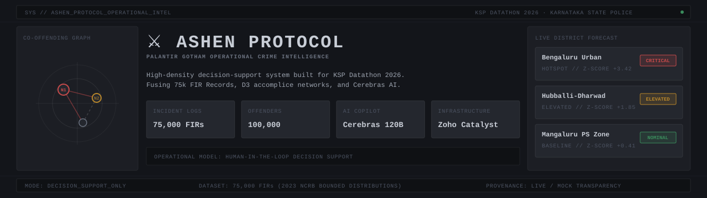
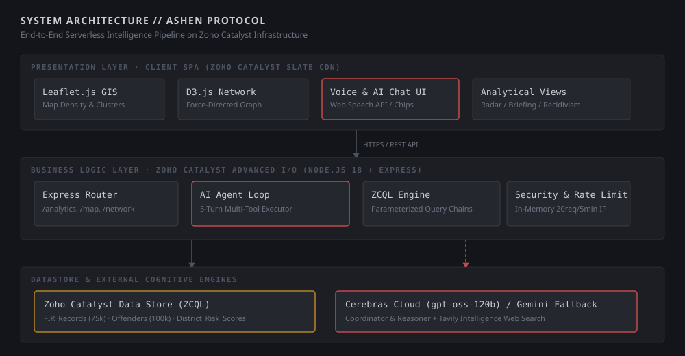

<div align="center">



# ⚔️ ASHEN PROTOCOL
### High-Density Operational Intelligence & Crime Analytics Platform
**Karnataka State Police (KSP) Datathon 2026 — Official Submission**

[](https://hack2skill.com)
[](https://catalyst.zoho.com)
[](https://cerebras.ai)
[](DESIGN.md)

</div>

---

## ⚖️ Ideology & Operational Framing

> **Decision-Support, Not Decision-Making**
> 
> *Ashen Protocol is engineered strictly as an operational intelligence and decision-support platform for law enforcement analysts within the Karnataka State Police Command Center. It provides real-time situational awareness, pattern discovery, spatiotemporal risk aggregation, and candidate identification. It does **NOT** perform automated target selection, predictive policing sentencing, or autonomous decision-making. All analytical outputs require human review, contextual verification, and procedural oversight by sworn police personnel.*

---

## 🎯 Executive Summary & Built Capabilities

Ashen Protocol addresses both key challenges of the **KSP Datathon 2026**:
1. **Challenge 1 — Intelligent Conversational AI Interface**: Multi-turn natural language query agent routing queries directly against relational datastores to produce instant statistical breakdowns, suspect lookups, and voice-assisted speech searches.
2. **Challenge 2 — AI-Driven Crime Analytics & Visualization Platform**: Enterprise GIS geospatial hotspot maps, D3.js force-directed gang network graphs, spatiotemporal Z-score risk forecasts, and automated SCRB daily intelligence briefings.

### 🌟 Core Feature Matrix (Grounded in Actual Implementation)

| Module | Feature | Implementation & Technical Realization | State |
|---|---|---|---|
| 🗺️ **GIS Geospatial Map** | **Interactive Hotspot Density & Cluster Layers** | Leaflet.js dark canvas (`CartoDB Dark Matter`) rendering dynamic density heat circles and custom Palantir-styled marker clusters (`L.markerClusterGroup`). Includes clickable popup dossiers with direct `[TRACE]` links into offender networks. | **Production Built** |
| 🕸️ **Accomplice Visualizer** | **D3.js Force-Directed Co-Offending Network** | D3.js v7 interactive graph mapping offender-to-case linkages, recidivism paths across FIRs, and gang syndicates. Features node drag handlers, collision spacing, hover tooltips, and deterministic PRNG network generation per FIR. | **Production Built** |
| 🤖 **AI Command Copilot** | **Cerebras 120B Multi-Turn Query Agent** | Dual-role coordinator/reasoner loop (`gpt-oss-120b` via Cerebras Cloud, with Gemini 2.5 Flash/Pro fallback). Executes parameterized database tools (`get_fir_stats`, `trace_accomplices`, `file_fir`, `fetch_intelligence_feed`) and Tavily web grounding. | **Production Built** |
| 🎙️ **Voice Search** | **Web Speech API Speech-to-Text** | Browser-native voice search overlay supporting Indian speech profiles (`en-IN`, `hi-IN`, `kn-IN`) with active recording status badges and direct dispatch to the AI Copilot endpoint. | **Production Built** |
| 📈 **Spatiotemporal Forecast** | **Z-Score Hotspot Anomaly Radar** | Statistical risk aggregation table calculating district incident spikes and categorizing offense distribution (*Theft & Property, Cybercrime, Narcotics, Violent Crimes, Financial Crimes*). | **Production Built** |
| 📄 **Strategic Briefing** | **SCRB Daily Intelligence Briefing Generator** | Dedicated LLM briefing engine producing structured markdown reports with executive threat summaries, district watchlists, operational recommendations, and one-click PDF / Markdown export. | **Production Built** |
| 🔍 **Case Dossier & MO** | **TF-IDF Modus Operandi Matching** | Detailed case view pairing suspect demographics with TF-IDF cosine similarity MO matching and demographic cohort recidivism matrix analysis. | **Production Built** |
| 🛡️ **Provenance & QA** | **Data Source Badges & Guided Tour** | Mandatory `X-Data-Source: live\|mock\|mixed` provenance headers rendering "SAMPLE DATA" indicators on affected panels, paired with a 10-step interactive guided tour overlay driving judges through the golden-path scenario. | **Production Built** |

---

## 🏗️ Architecture Overview

The system is deployed on **Zoho Catalyst** using a zero-overhead architecture: a Vanilla HTML5/CSS/JavaScript Single Page Application (SPA) served via Zoho Catalyst Slate CDN, backed by a Node.js 18 Express Advanced I/O serverless function querying the Zoho Catalyst Data Store via ZCQL.



### Data Pipeline & Compilation
To validate system throughput with enterprise-scale loads, raw 2023 NCRB crime statistics were compiled into a distribution-accurate dataset:
1. **NCRB Profile Ingestion (`data/triage_and_clean.py`)**: Processed crime distributions to seed realistic Karnataka incident ratios.
2. **Synthetic Data Engine (`generate_firs.py`)**: Scaled statistics to **75,000 incident logs** (`FIR_Records`) and **100,000 offender profiles** (`Offenders`).
3. **Constraint Verification (`verify_data.py`)**: Enforced geographic bounding within Karnataka (`11.5°N–18.5°N`, `74.0°E–78.5°E`), ~20% co-offending network linkage, multi-case recidivism paths, and zero null primary keys.

---

## 🛠️ Technology Stack

| Layer | Technology | Purpose / Configuration |
|---|---|---|
| **Frontend Web Client** | Vanilla HTML5 / ES6 JavaScript | Frameworkless SPA, 0kb bundle overhead, CSS Grid layout |
| **Design System** | Palantir Gotham Aesthetic | Charcoal palette (`#13151A`, `#1C1E24`), IBM Plex Mono / Sans typography |
| **GIS Mapping Engine** | Leaflet.js v1.9 + MarkerCluster | Dark tiles (`CartoDB`), heat circles, custom cluster styling |
| **Network Visualizer** | D3.js v7 Force Simulation | Co-offending node-link graphs, collision physics, drag handlers |
| **Analytics Charts** | Chart.js v4.4 | Category distribution breakdown donuts and risk radar charts |
| **Serverless Backend** | Zoho Catalyst Advanced I/O | Node.js 18 + Express.js API middleware |
| **Database & Queries** | Zoho Catalyst Data Store | Relational datastore queried via ZCQL (Catalyst Query Language) |
| **Cognitive Engine** | Cerebras Cloud (`gpt-oss-120b`) | Primary 5-turn multi-tool LLM agent coordinator & reasoner |
| **Fallback Cognitive Engine**| Google Gemini (`gemini-2.5-flash/pro`)| Secondary LLM provider toggled via `LLM_PROVIDER` in `.env` |
| **Web Grounding** | Tavily REST API | Live external intelligence web search fallback |

---

## ⚡ Quickstart & Local Setup

### Prerequisites
- **Node.js**: v18.x or higher
- **npm**: v9.x or higher
- *(Optional)* **Zoho Catalyst CLI**: `npm install -g zcatalyst-cli`

### Installation & Execution

1. **Clone the Repository**:
   ```bash
   git clone https://github.com/your-username/ashen-project.git
   cd ashen-project
   ```

2. **Install Dependencies**:
   ```bash
   npm install
   ```
   *(Note: The root `postinstall` script automatically installs dependencies inside `functions/ashen_api`).*

3. **Configure Environment Variables**:
   Create a `.env` file inside `functions/ashen_api/` (or copy `.env.example`):
   ```env
   CEREBRAS_API_KEY=your_cerebras_api_key_here
   GEMINI_API_KEY=your_gemini_api_key_here
   LLM_PROVIDER=cerebras
   TAVILY_API_KEY=your_tavily_api_key_here
   ```

4. **Start Local Development Server**:
   ```bash
   npm run dev
   ```
   *The backend Express API will start at `http://localhost:3000`. Open `client/index.html` in your browser or serve via any static file server.*

5. **Start Catalyst Emulator (Optional)**:
   ```bash
   npm run catalyst
   ```

---

## 📖 Methodology & Governance Links

Ashen Protocol incorporates full algorithmic transparency and operational governance directly within the application:
- **[In-App Algorithmic Methodology Page](client/methodology.html)**: Details the Z-score anomaly equations, recidivism cohort definitions, and TF-IDF cosine similarity calculations.
- **[In-App Model Card & Limitations Page](client/model-card.html)**: Outlines the decision-support disclaimer, bias mitigations, false-positive handling, and known limitations.

---

## ⚠️ Known Limitations & Evaluation Disclosures

To maintain rigor for technical judges, the following limitations of the current build are explicitly disclosed:
1. **Synthetic Recidivism Prior Scores**: When disconnected from a live Catalyst datastore, offender risk scores use distribution-accurate synthetic baseline scores rather than validated real-world Karnataka reoffending outcomes.
2. **Lexical MO Matching**: Modus Operandi matching utilizes TF-IDF cosine similarity over text descriptions rather than deep semantic embeddings.
3. **Static Fallback Data Provenance**: When the live datastore is unreachable in local dev mode, endpoints gracefully degrade to deterministic fallback fixtures and display a prominent **"SAMPLE DATA"** badge on all affected panels.

---

## 🤝 Credits & Acknowledgments

- **Karnataka State Police (KSP)**: For organizing the Datathon 2026 and providing real-world operational domain challenges.
- **Hack2Skill (H2S)**: Datathon execution platform partner.
- **Zoho Catalyst**: Cloud infrastructure and serverless platform partner.

---

## 📄 License

This project is licensed under the [MIT License](LICENSE) — feel free to use, modify, and adapt for law enforcement intelligence research.

