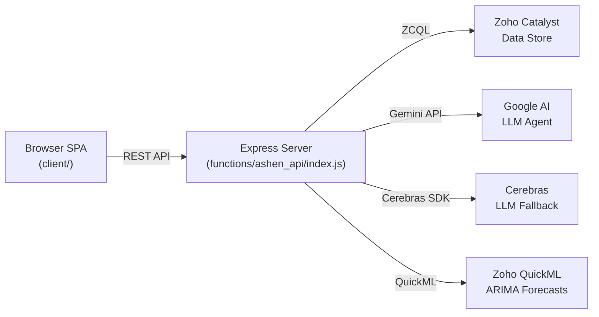

# 🔍 ASHEN PROTOCOL — Full Codebase Audit Report

## What This Project Is

**Ashen Protocol** is a KSP (Karnataka State Police) Datathon 2026 intelligence dashboard built on the **Zoho Catalyst** serverless platform. It is a **single-page application** with a Palantir Gotham-inspired dark UI.

### Architecture


### Key Files

| File | Purpose | Size |
|------|---------|------|
| [index.html](file:///c:/Users/Yoooo!/Pictures/ashen-project-main/ashen-project-main/client/index.html) | SPA shell — all views, panels, modals | 38 KB |
| [main.js](file:///c:/Users/Yoooo!/Pictures/ashen-project-main/ashen-project-main/client/main.js) | All frontend logic — 2,925 lines | 113 KB |
| [main.css](file:///c:/Users/Yoooo!/Pictures/ashen-project-main/ashen-project-main/client/main.css) | All styles — 2,849 lines | 55 KB |
| [index.js](file:///c:/Users/Yoooo!/Pictures/ashen-project-main/ashen-project-main/functions/ashen_api/index.js) | Express server — all API routes, LLM agent — 2,555 lines | 105 KB |
| [anomaly_engine.js](file:///c:/Users/Yoooo!/Pictures/ashen-project-main/ashen-project-main/functions/ashen_api/anomaly_engine.js) | Crime anomaly detection (hardcoded seed) | 3 KB |
| [cerebrasClient.js](file:///c:/Users/Yoooo!/Pictures/ashen-project-main/ashen-project-main/functions/ashen_api/cerebrasClient.js) | Cerebras SDK singleton | 645 B |

### Views / Screens
1. **Dashboard** — HUD stats + GIS Map + Risk Forecast Table + Crime Trend Chart
2. **GIS Map** — Same as dashboard (map is always visible in main layout)
3. **Network Graph** — D3.js force-directed suspect association graph
4. **Alerts / Anomaly Radar** — Crime anomaly cards
5. **Recidivism Matrix** — Scatter bubble chart + offender table (1,480 profiles)
6. **Station Cases** — Drill-down FIR table per police station
7. **Case Dossier** — Deep FIR case detail + suspect cards + D3 network
8. **Offender Dossier** — Fullscreen offender intelligence profile
9. **Inject FIR** — Live FIR complaint form
10. **Chat / AI Copilot** — Gemini/Cerebras-powered conversational agent

---

## 🚨 CRITICAL BUGS (Will Break the UI)

### BUG #1: CSS View-Switching Rules Target Non-Existent Classes
> **Severity: 🔴 CRITICAL — Breaks ALL navigation**

The CSS rules added at [main.css:2682-2700](file:///c:/Users/Yoooo!/Pictures/ashen-project-main/ashen-project-main/client/main.css#L2682-L2700) reference panel classes that **do not exist in the HTML**:

```css
/* These classes DON'T EXIST in index.html */
.main-panel,       /* ← HTML uses .main-area, not .main-panel */
.map-panel,         /* ← No .map-panel exists; map is inside .main-area > .map-area */
.network-panel,     /* ← Actually exists in HTML ✓ */
.alerts-panel,      /* ← No .alerts-panel exists; alerts are an overlay panel */
```

**Impact:** When switching to dashboard/map/alerts, the corresponding `display: flex !important` rule targets a non-existent element, so **nothing shows**. The original architecture does NOT use separate panel divs for dashboard/map/alerts — they are all nested inside `.main-area` which is always visible.

**The original view architecture works like this:**
- `.main-area` contains: HUD strip, map, bottom-row (risk table + network + trend chart)  
- `.station-cases-panel`, `.case-dossier-panel`, `.recidivism-panel` are separate `.panel` divs that hide/show via class
- Dashboard, Map, Network, and Alerts were NEVER separate panels — they were all part of `.main-area`

**Fix:** The `display: none !important` rules must NOT apply to `.main-panel`, `.map-panel`, or `.alerts-panel` (which don't exist). Instead, the `.main-area` should be shown/hidden, and only the panels that ARE separate (`.station-cases-panel`, `.case-dossier-panel`, `.recidivism-panel`, `.offender-dossier-panel`) need view-switching rules.

---

### BUG #2: `.network-panel` Gets `display: none !important` But It's Part of the Dashboard
> **Severity: 🔴 CRITICAL — Network graph disappears from dashboard**

The `.network-panel` in the HTML ([index.html:~line 150](file:///c:/Users/Yoooo!/Pictures/ashen-project-main/ashen-project-main/client/index.html)) is a child of `.bottom-row` inside `.main-area`. It is NOT a top-level panel that should be independently toggled. Applying `display: none !important` to it **hides the network graph area from the dashboard view permanently**.

---

### BUG #3: `openSuspectDossierModal` Called But Now Delegates to `openSuspectDossierPage` — Modal HTML Still Exists
> **Severity: 🟡 MEDIUM — Dead code, potential confusion**

At [main.js:~line 926](file:///c:/Users/Yoooo!/Pictures/ashen-project-main/ashen-project-main/client/main.js#L926), `openSuspectDossierModal` now just calls `openSuspectDossierPage`. But the old modal HTML `#suspect-dossier-modal` still exists in [index.html:~line 660](file:///c:/Users/Yoooo!/Pictures/ashen-project-main/ashen-project-main/client/index.html#L660) with close button wiring at [main.js:~line 930](file:///c:/Users/Yoooo!/Pictures/ashen-project-main/ashen-project-main/client/main.js). This is dead code that adds weight and confusion.

---

## ⚠️ HIGH-SEVERITY ISSUES

### BUG #4: SQL Injection Vulnerability in Multiple API Endpoints
> **Severity: 🔴 SECURITY — SQL injection via string interpolation**

The server uses string interpolation to build ZCQL queries throughout [index.js](file:///c:/Users/Yoooo!/Pictures/ashen-project-main/ashen-project-main/functions/ashen_api/index.js):

```js
// Line 319: district is user-supplied query param
let query = `SELECT ... FROM FIR_Records WHERE district = '${district.replace(/'/g, "''")}'`

// Line 2475: suspectName from user chat input
const query = `SELECT ... FROM Offenders WHERE offender_name LIKE '%${escapedName}%'`
```

While `replace(/'/g, "''")` provides basic quote escaping, this is NOT parameterized query protection. Specially crafted inputs could still exploit edge cases.

---

### BUG #5: API Keys Committed to Git in `.env`
> **Severity: 🔴 SECURITY — Credentials exposed**

[.env](file:///c:/Users/Yoooo!/Pictures/ashen-project-main/ashen-project-main/.env) contains live API keys for:
- Cerebras (`csk-nx642j...`)
- Google Gemini (`AQ.Ab8RN6...`)
- DeepSeek (`sk-630ee4...`)
- Multiple QuickML keys

These are committed to git and pushed to GitHub.

---

### BUG #6: `TAVILY_API_KEY=your_tavily_key_here` is a Placeholder
> **Severity: 🟡 MEDIUM**

[.env:11](file:///c:/Users/Yoooo!/Pictures/ashen-project-main/ashen-project-main/.env#L11) — This will cause failures if any code tries to use the Tavily API.

---

### BUG #7: Recidivism API Queries Wrong Table Name
> **Severity: 🟡 MEDIUM — Silent fallback masks error**

[index.js:547](file:///c:/Users/Yoooo!/Pictures/ashen-project-main/ashen-project-main/functions/ashen_api/index.js#L547):
```js
const query = `SELECT ... FROM Suspects LIMIT 100`;
```
But the actual table used everywhere else is `Offenders`, not `Suspects`. This query always fails silently, and the endpoint always returns the 1,480 hardcoded seed data instead of real datastore data.

---

### BUG #8: Hardcoded Absolute Path in Server Code
> **Severity: 🟡 MEDIUM — Breaks on any other machine**

[index.js:678](file:///c:/Users/Yoooo!/Pictures/ashen-project-main/ashen-project-main/functions/ashen_api/index.js#L678) and [index.js:861](file:///c:/Users/Yoooo!/Pictures/ashen-project-main/ashen-project-main/functions/ashen_api/index.js#L861):
```js
csvPath = path.join('C:', 'Users', 'Yoooo!', 'Documents', 'datathon', ...)
```
This hardcoded Windows user path will fail on any deployment or another developer's machine.

---

## 🔶 MEDIUM-SEVERITY ISSUES

### BUG #9: Duplicate `.env` Files
Both [.env](file:///c:/Users/Yoooo!/Pictures/ashen-project-main/ashen-project-main/.env) (root) and [functions/ashen_api/.env](file:///c:/Users/Yoooo!/Pictures/ashen-project-main/ashen-project-main/functions/ashen_api/.env) contain identical content. The `loadEnv()` function walks up directories, so the first one found is used. This creates confusion about which `.env` is the source of truth.

### BUG #10: Anomaly Engine is 100% Hardcoded
[anomaly_engine.js](file:///c:/Users/Yoooo!/Pictures/ashen-project-main/ashen-project-main/functions/ashen_api/anomaly_engine.js) completely ignores the `historicalData` and `recentIncidents` parameters — it always returns the same 5 hardcoded anomalies. The function signature implies dynamic detection but delivers static data.

### BUG #11: Network Graph Fallback Risk Scores Are 1-10, Not 0-100
[index.js:414-415](file:///c:/Users/Yoooo!/Pictures/ashen-project-main/ashen-project-main/functions/ashen_api/index.js#L414-L415):
```js
{ id: 'OFF-001042', ..., base_risk_score: 8.5 }
{ id: 'OFF-001089', ..., base_risk_score: 9.2 }
```
These are on a 1-10 scale, while the rest of the codebase uses a 0-100 scale. The risk badge logic (`>= 70 ? 'high'`) will show these as "low" risk when they should be critical.

### BUG #12: `flyTo` Without Correct Parameter Format
[main.css:2593-2598](file:///c:/Users/Yoooo!/Pictures/ashen-project-main/ashen-project-main/client/main.js) — In the anomaly inspect button handler, `DISTRICT_COORDS` stores `{ center: [lat, lng], zoom: N }` but `map.flyTo(coords, 12)` passes the entire object `{ center: [...], zoom: N }` instead of `coords.center`.

### BUG #13: `filterZone` Referenced But May Not Be Declared at Top
The code at [main.js:2332](file:///c:/Users/Yoooo!/Pictures/ashen-project-main/ashen-project-main/client/main.js#L2332) references `filterZone` but it's not declared in the DOM cache block at the top of the file (lines 7-35). If the element doesn't exist, the `if (filterZone)` guard will prevent a crash, but the zone dropdown filtering won't work.

### BUG #14: Dual-Directory Sync is Fragile
The project maintains identical code in both:
- `c:\Users\Yoooo!\Pictures\ashen-project-main\ashen-project-main\`
- `c:\Users\Yoooo!\Documents\ashen-project-main\ashen-project-main\`

This is a manual sync process that **will** drift. Any edit to one copy without mirroring to the other creates divergence.

### BUG #15: `COORDINATOR_MODEL` and `REASONER_MODEL` Are Declared But Routes Choose LLM at Runtime
[index.js:47-48](file:///c:/Users/Yoooo!/Pictures/ashen-project-main/ashen-project-main/functions/ashen_api/index.js#L47-L48):
```js
const COORDINATOR_MODEL = 'gemini-2.5-flash';
const REASONER_MODEL = 'gemini-2.5-pro';
```
These are used only in the Gemini agent path, but `LLM_PROVIDER` is set to `'cerebras'` in `.env`. The Gemini agent functions exist but are dormant behind the provider switch.

### BUG #16: Google OAuth Script Still Loaded
[index.html:13](file:///c:/Users/Yoooo!/Pictures/ashen-project-main/ashen-project-main/client/index.html#L13):
```html
<script src="https://accounts.google.com/gsi/client" async defer></script>
```
This loads the Google Identity Services SDK even though OAuth is explicitly disabled and hidden in the UI. Adds unnecessary network load.

---

## 🔵 LOW-SEVERITY / CODE QUALITY ISSUES

### Issue #17: Orphaned Files in Project Root
These files in the root directory appear to be development artifacts:
- `read_history.js`, `read_history.py`, `read_log_ws.py`, `read_routes.js` — Debug scripts
- `test.py`, `test_gemini.js`, `verify_fix.js`, `run_test.bat` — Test scripts
- `backfill_offenders.py`, `triage_and_clean.py`, `verify_data.py` — Data pipeline scripts
- `Import_*.zip` — Zoho import archives
- `2026-07-25 11-01-18.mp4` — A 2MB video file committed to git

### Issue #18: 36MB CSV File Committed to Git
[fir_records_seed.csv](file:///c:/Users/Yoooo!/Pictures/ashen-project-main/ashen-project-main/fir_records_seed.csv) is 36 MB and [offenders_seed.csv](file:///c:/Users/Yoooo!/Pictures/ashen-project-main/ashen-project-main/offenders_seed.csv) is 6 MB. These should be in `.gitignore` or stored in LFS.

### Issue #19: Monolithic File Sizes
- `main.js` is 2,925 lines / 113 KB — should be split into modules
- `index.js` (server) is 2,555 lines / 105 KB — should be split into route files
- `main.css` is 2,849 lines / 55 KB — should use component CSS files

### Issue #20: No Error Boundary on Frontend
If any API call fails, the dashboard shows `—` forever with no loading state or retry UI. There's no global error handler.

### Issue #21: `package.json` Missing `node_modules` in `.gitignore` Pattern
The [.gitignore](file:///c:/Users/Yoooo!/Pictures/ashen-project-main/ashen-project-main/.gitignore) should be checked to ensure `node_modules/` and `.env` are properly ignored.

### Issue #22: Chart.js and D3 Loaded From CDN Without Version Pinning
The HTML loads several libraries from CDNs (`leaflet@1.9.4` is pinned, but Chart.js and D3 appear to be loaded without strict version pinning from the `main.js` scripts section at the bottom of index.html).

---

## Summary Matrix

| # | Severity | Category | Description |
|---|----------|----------|-------------|
| 1 | 🔴 CRITICAL | CSS/Layout | View-switching CSS targets non-existent `.main-panel`, `.map-panel`, `.alerts-panel` classes |
| 2 | 🔴 CRITICAL | CSS/Layout | `.network-panel` hidden by view rules but is child of dashboard layout |
| 3 | 🟡 MEDIUM | Dead Code | Old suspect modal HTML + wiring still exists after refactor to fullscreen page |
| 4 | 🔴 SECURITY | SQL Injection | String interpolation in ZCQL queries across all endpoints |
| 5 | 🔴 SECURITY | Credentials | Live API keys committed to `.env` in Git |
| 6 | 🟡 MEDIUM | Config | Tavily API key is a placeholder string |
| 7 | 🟡 MEDIUM | Data | Recidivism endpoint queries `Suspects` table (doesn't exist) instead of `Offenders` |
| 8 | 🟡 MEDIUM | Portability | Hardcoded `C:\Users\Yoooo!\Documents\datathon\` paths in server |
| 9 | 🟡 MEDIUM | Config | Duplicate `.env` files at root and in functions dir |
| 10 | 🟡 MEDIUM | Logic | Anomaly engine ignores all inputs, always returns static data |
| 11 | 🟡 MEDIUM | Data | Network graph fallback risk scores on 1-10 scale vs 0-100 everywhere else |
| 12 | 🟡 MEDIUM | Logic | `flyTo(coords)` passes wrong object shape for Leaflet |
| 13 | 🟡 MEDIUM | JS | `filterZone` not declared in DOM cache block |
| 14 | 🟡 MEDIUM | Architecture | Dual-directory manual sync is fragile and will drift |
| 15 | 🟠 LOW | Dead Code | Gemini model constants declared but Cerebras is active provider |
| 16 | 🟠 LOW | Performance | Google OAuth SDK script loaded but OAuth is disabled |
| 17 | 🟠 LOW | Cleanup | Many orphaned debug/test scripts in root |
| 18 | 🟠 LOW | Git | 36MB CSV and 2MB MP4 committed to git history |
| 19 | 🟠 LOW | Architecture | Monolithic 100KB+ files should be modularized |
| 20 | 🟠 LOW | UX | No loading states or error boundaries on frontend |
| 21 | 🟠 LOW | Git | `.gitignore` needs review for `.env` and node_modules |
| 22 | 🟠 LOW | Security | CDN dependencies without subresource integrity hashes |

> [!CAUTION]
> **BUG #1 is the most urgent issue.** The CSS view-switching rules I added earlier today are breaking the dashboard, map, and alerts views because they target `.main-panel` / `.map-panel` / `.alerts-panel` which don't exist in the HTML. The original layout uses `.main-area` (always visible) with only `.station-cases-panel`, `.case-dossier-panel`, `.recidivism-panel`, and `.offender-dossier-panel` as independently toggleable panels.

Approve this audit to proceed with fixing the critical bugs.
